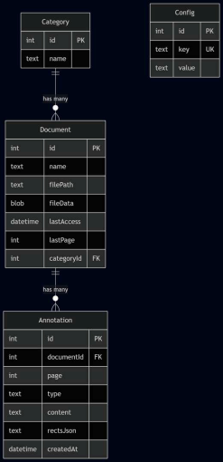

# IFVest Reader - Aplicativo Mobile de Leitura e Organização Acadêmica


O **IFVest Reader** é um aplicativo mobile desenvolvido em **Flutter** com a linguagem **Dart**, projetado para oferecer a estudantes acadêmicos e preparatórios uma experiência de estudo mais prática, organizada e eficiente. Integrado nativamente à plataforma **IFVest**, o aplicativo centraliza materiais didáticos e oferece recursos avançados de leitura, anotação e acompanhamento de progresso.

---

## 🎯 Problema e Solução

Muitos estudantes enfrentam dificuldades com a dispersão de conteúdos didáticos espalhados por múltiplas plataformas, o que gera perda de tempo, desorganização e prejuízo no rendimento escolar. O **IFVest Reader** resolve essa dor centralizando os materiais didáticos e disponibilizando um leitor interativo de alta performance com ferramentas otimizadas para o estudo ativo.

---

## ✨ Funcionalidades Principais

### 📖 Leitor Otimizado de Arquivos
- **Modos de Visualização Flexíveis**: Alternância entre rolagem vertical, rolagem horizontal e *Modo Leitura* focado.
- **Pesquisa de Palavras**: Busca textual instantânea dentro dos documentos para localização rápida de termos e conceitos.
- **Transcrição de Texto para Voz (TTS)**: Recursos de síntese de voz (Text-to-Speech) para acessibilidade e estudo audível.
- **Sumário Automático**: Geração e exibição de índice interativo para navegação estruturada.

### 📝 Anotações e Estudo Ativo
- **Marcações e Destaques**: Seleção e grifo de trechos importantes em diferentes cores.
- **Comentários e Anotações**: Inserção de notas personalizadas vinculadas a páginas e trechos do texto.
- **Navegação entre Anotações**: Atalho para alternar rapidamente entre todos os comentários e marcações efetuados no documento.

### 🧭 Navegação Inteligente e Acompanhamento
- **Memória de Posição**: Carregamento automático da última página acessada (*last page loading*).
- **Salto Direto de Página**: Ir diretamente para uma página específica inserindo o número desejado.
- **Acompanhamento de Progresso**: Indicadores visuais do percentual de leitura concluído e histórico de estudo.
- **Categorização Temática**: Organização e classificação de materiais por disciplinas, módulos e tópicos.

---

## Diagrama de entidade relacionamento



---

## 🔄 Fluxo do Sistema

O fluxo de funcionamento da aplicação do carregamento à leitura e persistência ocorre conforme o diagrama e etapas abaixo:

```text
[Usuário] 
         │
         ├──► 1. Seleção do Documento PDF
         │
         ├──► 2. Armazenamento Local
         │
         ├──► 3. Abertura & Renderização no Leitor
         │
         ├──► 4. Leitura Interativa & Ações:
         │         ├─► Pesquisa de Palavras & Sumário
         │         ├─► Leitura Audível (TTS)
         │         └─► Anotações / Marcações
         │
         ├──► 5. Persistência de Dados & Estado ──────► (Drift / SQLite)
         │
         └──► 6. Retomada de Leitura ─────────────────► (Carregamento automático da última página)
```

### Etapas do Fluxo:
1. **Inserção de documentos**: O estudante insere um documento na página de inserção a partir de documentos no dispostivo e, caso não tenha a categoria desejada, pode inserir novas categorias, visualizar um preview do documento e colocar o nome que quiser no arquivo.
2. **Processamento & Sincronização**: O documento é salvo no drift, um banco de dados local em sqlite. Todos os documentos são carregados na home page e ao clicá-lo, o documento abre.
3. **Renderização do Documento**: O arquivo é processado e exibido interativamente através dos motores `syncfusion_flutter_pdfviewer`, gerando o sumário e permitindo a troca de modos de visualização (vertical/horizontal/modo leitura).
4. **Interação e Estudo Ativo**:
   - O aluno realiza busca por palavras-chave e navega diretamente para páginas ou anotações específicas.
   - Ativa a funcionalidade de voz sobre texto via `flutter_tts`.
   - Adiciona comentários, destaques e anotações sobre o texto.
5. **Persistência Relacional e Preferências**:
   - Todas as anotações, destaques, históricos de leitura e página acessada são salvos de forma relacional no banco de dados.
6. **Restauração da Sessão**: Ao reabrir o documento, o app identifica a última página salva e restaura o estado exato de leitura e anotações do estudante.

---

## 🛠️ Tecnologias e Dependências

Abaixo estão listadas as tecnologias e bibliotecas utilizadas no projeto conforme especificado no arquivo `pubspec.yaml`:

### ⚡ Ambientes e SDKs
- **Flutter SDK**: `flutter`
- **Dart SDK**: `^3.10.0-290.4.beta`

### 📦 Dependências Principais (`dependencies`)

| Biblioteca | Versão | Finalidade / Aplicação no Projeto |
| :--- | :--- | :--- |
| **`syncfusion_flutter_pdfviewer`** | `^33.1.44` | Renderização interativa de PDFs, suporte a gestos, busca e seleção de texto |
| **`syncfusion_flutter_pdf`** | `^33.1.44` | Manipulação programática, extração de texto e estruturação de documentos PDF |
| **`pdfx`** | `^2.6.0` | Motor complementar de visualização e renderização de páginas PDF |
| **`flutter_tts`** | `^4.2.0` | Síntese de fala (Text-to-Speech) para transcrição de texto em voz |
| **`drift`** | `^2.20.0` | ORM reativo e estruturado para gerenciamento do banco de dados SQLite |
| **`sqlite3_flutter_libs`** | `^0.5.24` | Inclusão dos binários nativos atualizados do SQLite3 em plataformas móveis |
| **`shared_preferences`** | `^2.5.4` | Armazenamento de preferências simples e salvamento da última página acessada |
| **`file_picker`** | `^8.0.0` | Seleção de arquivos locais de documentos no dispositivo |
| **`image_picker`** | `^1.0.7` | Captura ou seleção de imagens para digitalização / suporte |
| **`http`** | `^1.6.0` | Comunicação com as APIs REST da plataforma IFVest |
| **`path_provider`** | `^2.1.5` | Localização de diretórios padrão do sistema de arquivos (documentos/cache) |
| **`path`** | `^1.9.0` | Manipulação e junção segura de caminhos de arquivos |
| **`intl`** | `^0.19.0` | Formatação de datas, horas e internacionalização |
| **`web`** | `^1.0.0` | Suporte e interoperação com APIs web |

### 🛠️ Dependências de Desenvolvimento (`dev_dependencies`)

| Biblioteca | Versão | Finalidade |
| :--- | :--- | :--- |
| **`drift_dev`** | `^2.20.0` | Gerador de código para mapeamento e consultas de tabelas no Drift |
| **`build_runner`** | `^2.4.9` | Ferramenta de geração automática de código no Flutter/Dart |
| **`flutter_lints`** | `^5.0.0` | Regras oficiais de análise estática de código para boas práticas |
| **`flutter_test`** | `sdk: flutter` | Framework de testes unitários e de widgets |

---

## 🚀 Instalação e Execução

### Pré-requisitos

Antes de começar, certifique-se de ter instalado em sua máquina:
- [Git](https://git-scm.com/)
- [Flutter SDK](https://docs.flutter.dev/get-started/install) (versão 3.0.0 ou superior)
- [Android Studio](https://developer.android.com/studio) ou [VS Code](https://code.visualstudio.com/) com a extensão do Flutter/Dart
- Emulador Android/iOS ou um dispositivo físico conectado via Depuração USB
- O aplicativo também pode ser usado na versão WEB

### Passo a Passo

1. **Instalar as Dependências:**
   ```bash
   flutter pub get
   ```

2. **Verificar o Ambiente Flutter:**
   ```bash
   flutter doctor
   ```

3. **Executar a Aplicação:**
   ```bash
   flutter run
   ```